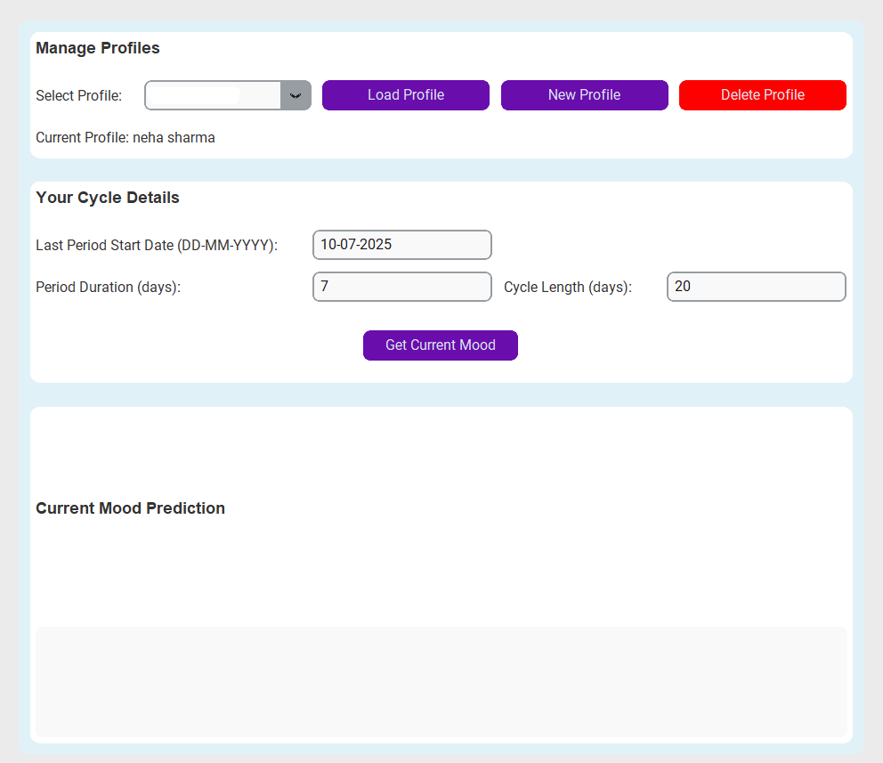

# Period & Ovulation Tracker App

This is a lightweight, desktop-based application designed to help individuals track their menstrual cycle phases, manage personal or partner profiles, and receive mood insights based on biological rhythms. Built using Python and [CustomTkinter](https://github.com/TomSchimansky/CustomTkinter), the app features a clean, responsive interface and stores data securely on your local system.

Whether you're developing a better understanding of your health or supporting a partner, this app offers a practical and elegant solution.

---

## Screenshot

<p align="center">
  
</p>

---

## Key Features

- Cycle phase detection (Menstruation, Follicular, Ovulation, Luteal)
- Personalized mood and wellness predictions
- Profile management with support for multiple users
- Intuitive input system for tracking last period date, cycle length, and duration
- Persistent local storage using a JSON file
- Dark and light theme support

---

## Getting Started

### Prerequisites

- Python 3.8 or higher
- It is recommended to use a virtual environment

### Installation

1. Clone this repository or download the source code.
2. Install the necessary dependencies:

```bash
pip install customtkinter packaging darkdetect
