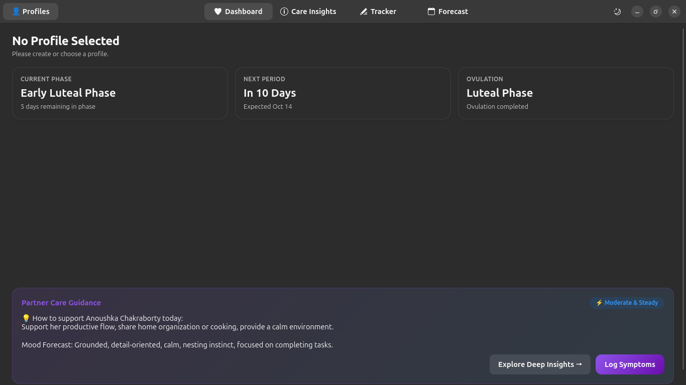

# Cycle and Mood Tracker (Cross-Platform)


An intelligent, scientific cycle and mood tracker with relationship care guidance, built with a modern GTK4 / Libadwaita native interface and adaptive cross-platform fallback for Linux, Windows, and macOS.

---

## 1. Overview and Core Purpose

Most conventional period tracking applications operate as simple calendar counters or are bundled inside cloud-dependent mobile apps that collect and monetize sensitive reproductive health data. 

The Cycle and Mood Tracker is engineered to address three primary needs:
1. **Biological and Psychological Literacy**: Translate complex hormonal fluctuations (Estrogen, Progesterone, Luteinizing Hormone, and Testosterone) into actionable insights regarding energy, cognition, mood, and physical symptoms.
2. **Proactive Relationship Care**: Provide partners with clear, contextual daily guidance on how to offer emotional reassurance, physical care, and nutritional support without guesswork.
3. **Absolute Privacy and Data Sovereignty**: Function entirely offline with zero cloud telemetry, storing all records locally in human-readable, user-owned files with atomic write guarantees.

---

## 2. Mathematical and Algorithmic Logic

### 2.1. Modular Cycle Day Calculation
The active cycle day is calculated using modular arithmetic relative to the reference period start date:

$$\text{Days Elapsed} = D_{\text{target}} - D_{\text{last\_start}}$$

$$\text{Cycle Day} = (\text{Days Elapsed} \pmod L) + 1$$

Where:
- $D_{\text{target}}$ is the date being evaluated (defaults to current date).
- $D_{\text{last\_start}}$ is the verified onset date of the last recorded period.
- $L$ is the user's average cycle length (clamped to a biologically valid minimum $L \ge 15$).

To identify the actual start date of the active cycle period:
$$D_{\text{current\_cycle\_start}} = D_{\text{last\_start}} + \left(\left\lfloor \frac{\text{Days Elapsed}}{L} \right\rfloor \times L\right)$$

### 2.2. Dynamic Phase Segmentation Algorithm
Rather than relying on fixed calendar dates, phase transitions are dynamically computed based on biological constants and individual parameters:

- **Biological Constant**: In clinical gynecology, the post-ovulatory (luteal) phase is physiologically constant at approximately 14 days across varying cycle lengths.
- **Ovulation Day ($d_{\text{ov}}$)**:
  $$d_{\text{ov}} = \max(d_{\text{period}} + 2, \, L - 14)$$
- **Fertile Window Bounds**:
  $$\text{Fertile Start} = \max(d_{\text{period}} + 1, \, d_{\text{ov}} - 4)$$
  $$\text{Fertile End} = d_{\text{ov}} + 1$$
- **Phase Allocation Logic**:
  1. **Menstrual Phase** ($\text{Day} \in [1, d_{\text{period}}]$): Estrogen and progesterone are at baseline. Focus on rest, uterine recovery, and iron replenishment.
  2. **Follicular Phase** ($\text{Day} \in [d_{\text{period}} + 1, \text{Fertile Start} - 1]$): Rising estradiol promotes neuroplasticity, rising stamina, and creative focus.
  3. **Ovulation / Fertile Window** ($\text{Day} \in [\text{Fertile Start}, \text{Fertile End}]$): Peak LH surge, maximal estrogen, and elevated testosterone; peak energy, verbal fluency, and social confidence.
  4. **Early Luteal Phase** ($\text{Day} \in [\text{Fertile End} + 1, L - 5]$): Progesterone surge elevates basal body temperature and metabolic rate; grounded, detail-oriented task execution.
  5. **Late Luteal / Pre-Menstrual Phase** ($\text{Day} \in [L - 4, L]$): Rapid hormone withdrawal prior to menses; heightened stress sensitivity, potential emotional volatility, and physical fluid retention.

### 2.3. Multi-Month Future Projection Algorithm
Future cycle milestones are projected iteratively over an $N$-month horizon using recurrence relations:

$$S_k = S_0 + (k \times L) \quad \text{for } k \in [1, N]$$
$$O_k = S_k + d_{\text{ov}} - 1$$
$$F_k = [S_k + \text{Fertile Start} - 1, \, S_k + \text{Fertile End} - 1]$$

Where $S_k$ is the projected start date of the $k$-th cycle, $O_k$ is the projected ovulation date, and $F_k$ is the projected fertile window.

### 2.4. Circular Polar Dial Vector Rendering
The visual wheel maps discrete cycle days into continuous angular radians on a 2D Cartesian plane:

$$\theta_{\text{start}} = -\frac{\pi}{2}, \quad \Delta\theta = \frac{2\pi \times \text{day}}{L}$$

- **Background Track**: Rendered as a full circle arc from $0$ to $2\pi$ with low-opacity RGBA stroke.
- **Progress Arc**: Swept from $\theta_{\text{start}}$ to $\theta_{\text{start}} + \Delta\theta$ using phase-specific RGB color grading.
- **Pointer Vector**: Positioned at polar coordinates $(x, y) = (c_x + r\cos(\theta_{\text{curr}}), \, c_y + r\sin(\theta_{\text{curr}}))$.

---

## 3. System Architecture and Design Decisions

```
├── main.py                     # Entry point, CLI dispatcher, and backend selector
├── app.py                      # Backward-compatibility alias
├── core/
│   ├── models.py               # Domain dataclasses: Profile, CycleRecord, DailyLog, PhaseInfo
│   ├── calculator.py           # Scientific phase algorithms and wellness rule engine
│   ├── storage.py              # Atomic JSON persistence repository and backup engine
│   └── platform_detector.py    # Runtime OS, desktop, and GUI toolkit inspector
├── ui/
│   ├── base.py                 # Abstract base GUI interface (BaseApp)
│   ├── gtk/                    # GTK4 and Libadwaita native implementation
│   │   ├── app.py              # Adw.Application lifecycle and CSS loader
│   │   ├── window.py           # Adw.ApplicationWindow, ViewStack, and ViewSwitcher
│   │   ├── dashboard_view.py   # Main overview cards and quick action triggers
│   │   ├── cycle_canvas.py     # Hardware-accelerated Cairo anti-aliased circular dial
│   │   ├── insights_view.py    # Hormonal, emotional, and partner care analysis
│   │   ├── tracker_view.py     # Daily symptom, mood, and note logging form
│   │   ├── history_view.py     # 6-month projections and historical log list
│   │   ├── profiles_dialog.py  # Modal profile creation and deletion dialog
│   │   └── style.css           # Adwaita theme styling and accent definitions
│   └── tk_fallback/            # Universal Tkinter / ttk fallback implementation
│       ├── app.py              # Full feature-parity Tkinter application
│       └── cycle_canvas.py     # Tkinter Canvas vector wheel renderer
```

### 3.1. Decoupled Dual-Backend Architecture
- **Decision**: Introduce an abstract UI contract (`ui/base.py`) implemented by both a modern GTK4/Libadwaita subsystem (`ui/gtk/`) and a universal Tkinter/ttk subsystem (`ui/tk_fallback/`).
- **Rationale**: GTK4 with Libadwaita provides high-performance rendering, Wayland integration, and native GNOME desktop styling on modern Linux distributions. However, distributing GTK4 runtimes on Windows and macOS introduces significant friction and large dependency footprints. The automated fallback architecture allows the application to run natively on GNOME/Wayland while remaining instantly runnable on Windows, macOS, or minimal Linux installations without code changes or separate binaries.

### 3.2. Runtime Environment Probing (`PlatformDetector`)
- **Decision**: Perform non-destructive environment probing at startup to dynamically select the optimal toolkit.
- **Rationale**: Direct static imports of missing GUI libraries cause unhandled `ImportError` exceptions or trigger false-positive warnings in static linters (such as Pyright or IDE language servers). By utilizing `importlib.util.find_spec` and dynamic introspection, the probe evaluates available libraries without polluting module caches or raising static analysis diagnostics.

### 3.3. Atomic File Persistence and Schema Resilience
- **Decision**: Use single-file JSON storage paired with atomic POSIX temporary-file swapping and automated backup mirroring (`.bak`).
- **Rationale**: 
  - *Why not SQLite?* User profile and symptom data for an individual is lightweight (typically under 1 MB over years of usage). JSON allows users to inspect, export, backup, or version-control their personal data with standard text utilities.
  - *Atomic Swapping Guarantee*: Writing directly to a live file risks corruption if the process is terminated mid-write (power loss, system freeze). The `StorageManager` writes updates to a temporary file on the same filesystem, flushes to disk, and executes an atomic `os.replace()` call. A copy of the previous state is preserved in `girlfriend_data.json.bak` prior to replacement.

### 3.4. Pure Domain Separation and 500-Line Code Boundaries
- **Decision**: Maintain strict separation between domain models (`core/models.py`), calculation engines (`core/calculator.py`), storage layers (`core/storage.py`), and presentation components (`ui/`), with all files strictly under 500 lines of code.
- **Rationale**: Isolating domain logic from UI widgets allows automated verification of biological algorithms independently of GUI frameworks. It also ensures long-term maintainability and prevents monolithic code degradation.

---

## 4. Engineering Challenges and Technical Solutions

### 4.1. PyGObject Cairo Struct Marshaling
- **Problem**: When GTK4's `Gtk.DrawingArea` invokes a custom drawing callback registered via `set_draw_func(self._on_draw)`, PyGObject passes a native C pointer (`cairo_t*`) into Python. Without Python Cairo bindings explicitly loaded in the runtime namespace, PyGObject cannot resolve the foreign struct converter, raising `TypeError: Couldn't find foreign struct converter for 'cairo.Context'`.
- **Solution**: Explicitly import `cairo` in `ui/gtk/cycle_canvas.py` alongside `from gi.repository import Gtk`, registering the required foreign struct introspection converter before any drawing surface is instantiated.

### 4.2. Pango Markup Entity Collisions in Toast Notifications
- **Problem**: Libadwaita's `Adw.Toast` interprets message strings as Pango markup by default. When displaying notifications containing unescaped characters (such as ampersands in "Today's symptoms & mood saved"), Pango parser threw XML parsing errors.
- **Solution**: Sanitized notification messages and implemented entity escaping (`message.replace("&", "&amp;")`) inside `show_toast` in `ui/gtk/window.py`.

### 4.3. Cross-Platform Vector Coordinate Alignment
- **Problem**: Cairo operates on floating-point sub-pixel coordinates with anti-aliasing, whereas Tkinter's Canvas arc rendering requires integer bounding boxes and angle conventions measured clockwise from 3 o'clock in degrees rather than counter-clockwise from 12 o'clock in radians.
- **Solution**: Implemented mathematical coordinate translation adapters in `ui/tk_fallback/cycle_canvas.py` to match the exact visual proportions and phase colors of the GTK4 Cairo dial.

---

## 5. Real-World Practical Utility

1. **For Individuals**:
   - Understand why motivation, energy, and physical sensations change throughout the month.
   - Plan demanding physical activities, social engagements, or deep creative work around peak energy phases.
   - Track physical symptoms over time to provide structured data for medical consultations.

2. **For Partners**:
   - Eliminates uncertainty regarding hormonal phase transitions and emotional sensitivity windows.
   - Replaces vague assumptions with concrete, supportive actions (adjusting chore distribution, preparing anti-inflammatory meals, planning low-stimulation evenings during late luteal phases).

3. **For Privacy-Conscious Users**:
   - Zero accounts, zero internet access required, zero telemetry.
   - Full control and portability of personal health logs.

---

## 6. Installation and Execution

### 6.1. Prerequisites

- Python 3.8 or higher.
- System GUI dependencies:
  - **Linux (Debian/Ubuntu/Pop!_OS)**:
    ```bash
    sudo apt install python3-gi python3-gi-cairo gir1.2-gtk-4.0 gir1.2-adw-1 python3-cairo
    ```
  - **Linux (Fedora/RHEL)**:
    ```bash
    sudo dnf install python3-gobject gtk4 libadwaita pycairo
    ```
  - **Linux (Arch)**:
    ```bash
    sudo pacman -S python-gobject gtk4 libadwaita python-cairo
    ```
  - **Windows / macOS**: Standard Python installation with built-in `tkinter`.

### 6.2. Python Dependencies

Install required Python packages:

```bash
pip install -r requirements.txt
```

### 6.3. Running the Application

```bash
# Auto-detect and launch the optimal native UI:
python3 main.py

# Inspect platform and toolkit diagnostic detection:
python3 main.py --info

# Force a specific GUI backend:
python3 main.py --backend gtk4_adwaita
python3 main.py --backend tkinter
```
